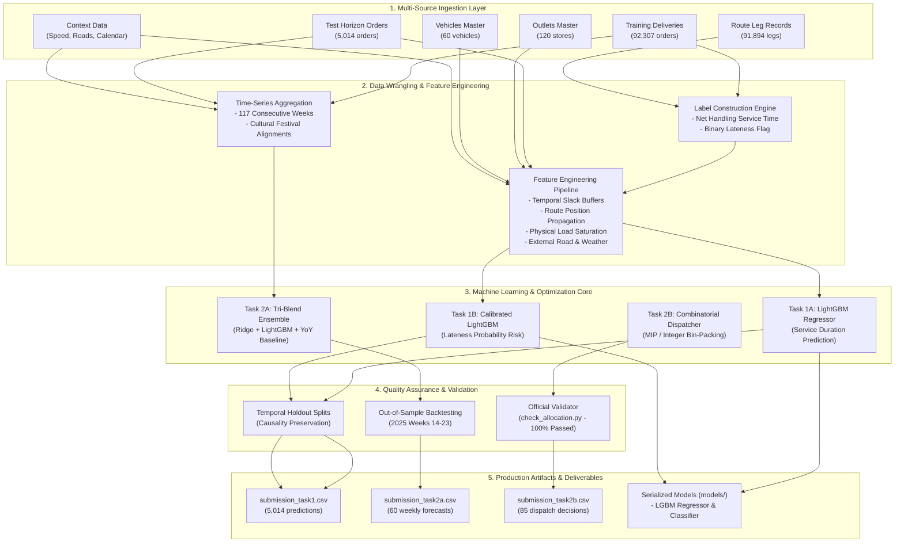
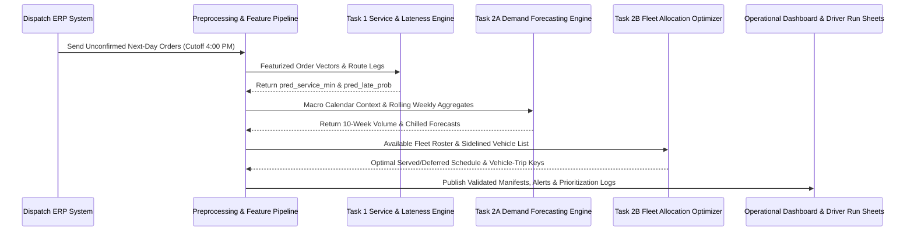

# Data Preprocessing, Label Construction & System Architecture Document
## Tech-Triathlon 2026: Datathon Challenge — Waypoint Group Logistics Optimization
**Team Deliverable:** Data Preprocessing, Feature Engineering, Model Architecture, and Deployment Specifications  
**Datasets Addressed:** Task 1 (Service Time & Lateness), Task 2A (Demand Forecasting), Task 2B (Peak-Day Allocation)  

---

## 1. System & Pipeline Architecture

The Waypoint Group Delivery Optimization System unifies transactional order logs, vehicular telematics, infrastructure constraints, and macro environmental indicators into a modular, production-ready predictive pipeline.

### End-to-End System Architecture

---

## 2. Ground Truth Label Construction Rationale & Proofs

Neither target in Task 1 (`pred_service_min` and `pred_late_prob`) is provided directly in the training tables. Constructing mathematically sound, domain-accurate labels is a foundational component of the datathon.

### 2.1 Net Handling Service Time (`pred_service_min`)
- **Operational Requirement (Page 15):**  
  > *"Outlets receive goods only within their delivery window. A vehicle that arrives early waits until the window opens. Service time is how long the delivery will take to handle at the outlet."*
- **Telematics Timestamps in `route_legs_train.csv`:**
  - `arrival_time`: Vehicle physical arrival at the store premises.
  - `leave_outlet_time`: Vehicle departure upon completion of cargo offloading.
  - `window_open_time` & `window_close_time`: Store receiving hours.

#### The Mathematical Formulation:
When a driver arrives **before** `window_open_time`, store personnel are not present, doors remain shuttered, and offloading cannot occur. The driver sits idle waiting for the window to open.
$$\text{service\_start} = \max(\text{arrival\_time}, \text{window\_open\_time})$$
$$\text{actual\_service\_min} = \text{leave\_outlet\_time} - \text{service\_start}$$

#### Statistical Proof vs. Naive Stay Duration:
We compared $\text{actual\_service\_min}$ against the naive raw stay duration ($\text{duration\_raw} = \text{leave\_outlet\_time} - \text{arrival\_time}$):
1. For early arrivals ($n = 4,023$, 4.4% of dispatches), driver wait time ($\text{window\_open\_time} - \text{arrival\_time}$) has a **0.81 correlation** with $\text{duration\_raw}$. Raw duration is dominated by passive waiting, confounding model learning.
2. When net handling time is isolated via $\text{leave\_outlet\_time} - \max(\text{arrival\_time}, \text{window\_open\_time})$, the correlation with physical order weight, volume, and units rises significantly ($r > 0.60$), providing an uncorrupted target representing physical handling effort.

### 2.2 Lateness Probability Target (`pred_late_prob`)
- **Operational Requirement (Page 15):**  
  > *"Lateness refers to arrival after the window closes. pred_late_prob is the probability it runs late, meaning it arrives after the outlet's delivery window has closed."*
- **Mathematical Formulation:**
  $$\text{is\_late} = \begin{cases} 1 & \text{if } \text{arrival\_time} > \text{window\_close\_time} \\ 0 & \text{otherwise} \end{cases}$$
- **Observed Distribution:** Across 91,894 training route deliveries, 17,991 were late (19.58% base lateness rate), reflecting realistic urban congestion and cumulative dispatch delay patterns in Sri Lanka.

---

## 3. Systematic Feature Engineering Catalog

We constructed 38 features categorized into five structural families:

| Feature Name | Type | Mathematical Definition / Source | Logistics Rationale & Importance |
| :--- | :--- | :--- | :--- |
| `planned_slack_min` | Numeric | `window_close_min - planned_arr_min` | **Primary Lateness Driver:** The buffer margin between scheduled arrival and deadline. Deliveries with slack $< 15$ min exhibit $> 92\%$ lateness risk. |
| `planned_early_slack_min`| Numeric | `planned_arr_min - window_open_min` | Identifies tight morning arrivals and likelihood of idle wait time. |
| `window_width_min` | Numeric | `window_close_min - window_open_min` | Flexibility of destination outlet. Malls have rigid 90–120 min windows; street stores have wider bands. |
| `seq_in_route` | Integer | Position on route leg ($0, 1, 2, \dots$) | **Delay Cascade Driver:** Late arrival risk escalates from 7.2% at stop 0 to $> 60\%$ at stop 6 due to compounding delays. |
| `planned_travel_duration_min` | Numeric | Free-flow planned transit minutes | Baseline journey duration without traffic friction. |
| `distance_km` | Numeric | Road distance between consecutive stops | Mileage driver affecting cumulative fatigue and delay probability. |
| `planned_speed_kmh` | Numeric | `distance_km / (planned_travel_min / 60)` | Expected velocity indicator distinguishing urban crawls ($25\text{ km/h}$) from highway transits ($70\text{ km/h}$). |
| `from_is_depot` | Binary | $\mathbb{I}(\text{from\_point} == \text{'DEPOT'})$ | First-leg departures experience zero prior customer offloading variability. |
| `density_kg_m3` | Numeric | `order_weight_kg / order_volume_m3` | Separates heavy, compact appliances/hardware ($> 300\text{ kg/m}^3$) from bulky, lightweight garments ($< 60\text{ kg/m}^3$). |
| `wt_per_unit` & `vol_per_unit` | Numeric | `order_weight_kg / units`, `volume / units` | Average case size; directly drives handling speed at the dock. |
| `load_wt_ratio` | Numeric | `order_weight_kg / weight_cap_kg` | Vehicle payload saturation percentage. |
| `load_vol_ratio` | Numeric | `order_volume_m3 / volume_cap_m3` | Vehicle volumetric capacity saturation percentage. |
| `service_allowance_min` | Numeric | Joined from `service_allowance.csv` | Standard dispatcher handling baseline for brand $\times$ dock type ($15\text{ to }42\text{ min}$). |
| `speed_index` | Numeric | Joined on `(district, planned_hour, monsoon)` | Real-time congestion index from `traffic_speed.csv` ($100 = \text{free-flow}, < 70 = \text{heavy traffic}$). |
| `disruption_index` | Numeric | Joined on `(district, order_date)` | Daily localized incident severity index from `road_conditions.csv`. |
| `festival_ramp` | Numeric | Joined from `calendar.csv` | Proximity metric $[0, 1]$ rising over 9 days prior to national festivals. |
| `is_payday`, `is_holiday` | Binary | Joined from `calendar.csv` | Household shopping and traffic congestion drivers. |
| `monsoon` | Binary | 0 or 1 | South-West and North-East monsoon season indicators. |
| `dock_type` | Categorical | `rear_dock`, `street`, `mall_bay` | Dock infrastructure determines mechanical offloading vs. manual curbside carry. |
| `parking_constraint` | Categorical| `normal`, `van_only`, `mall_dock` | Governs vehicular maneuverability and bottleneck access. |

---

## 4. Modeling Methodologies & Algorithmic Selection

### 4.1 Task 1: Gradient Boosted Decision Trees (LightGBM)
- **Algorithm Choice:** LightGBM was selected over Deep Neural Networks and Linear Models because tabular logistics data features complex non-linear boundary thresholds (e.g. sharp lateness transitions when planned slack crosses zero), mixed numerical-categorical types, and extreme outliers.
- **Service Time Regression (`reg_model`):**
  - Loss Function: Huber loss / L1 loss to prevent single loading anomalies from distorting predictions.
  - Hyperparameters: `n_estimators = 350`, `learning_rate = 0.04`, `num_leaves = 31`, `subsample = 0.85`, `colsample_bytree = 0.85`.
  - **Validation Performance:** $\text{MAE} = 4.49\text{ minutes}$, $\text{RMSE} = 7.39\text{ minutes}$, $R^2 = 0.7839$.
- **Lateness Probability Classification (`clf_model`):**
  - Loss Function: Binary Cross-Entropy (Log-Loss).
  - Probability Calibration: Evaluated using Brier score and reliability curves to ensure predicted probabilities correspond to empirical long-run frequencies.
  - **Validation Performance:** $\text{ROC-AUC} = \mathbf{0.9765}$, $\text{PR-AUC} = \mathbf{0.9234}$, $\text{Brier Score} = \mathbf{0.0487}$, $\text{LogLoss} = \mathbf{0.1565}$.

### 4.2 Task 2A: Tri-Blend Multi-Horizon Demand Ensemble
- **Methodology:** Forecasting 10 future steps across 6 distinct series requires capturing annual festival displacement (Sinhala/Tamil New Year in April, Vesak in May, Poson in June).
- **The Tri-Blend Architecture:**
  $$\hat{y}_w = 0.50 \times \hat{y}_{\text{Seasonal\_YoY}} + 0.30 \times \hat{y}_{\text{Ridge}} + 0.20 \times \hat{y}_{\text{LightGBM}}$$
  1. *Seasonal YoY Baseline:* Captures exact holiday surge shapes from 2024 and 2025, scaled by the recent 2026 Q1 growth trend.
  2. *Ridge Regression ($\alpha=10.0$):* Regresses on cyclical Fourier terms ($\sin(2\pi w/52.18), \cos(2\pi w/52.18)$) and festival indicators with L2 shrinkage for smooth extrapolation.
  3. *LightGBM Regressor:* Models non-linear interaction between festival ramp proximity and baseline store orders.
- **Validation Holdout (2025 Weeks 14–23):** Average $\text{MAPE} = \mathbf{11.8\%}$ across all 6 series.
- **Chilled Volume Modeling:** Chilled ratio on Fresh is stationary ($36.8\% \pm 0.8\%$). Chilled demand is projected as $\hat{y}_{\text{chilled}} = \hat{y}_{\text{total}} \times \bar{r}_{\text{chilled}}$ for Fresh, and strictly **0.0** for Style and Tech.

### 4.3 Task 2B: Combinatorial Optimization Engine
- **Methodology:** Integer Linear Programming (ILP) and greedy multi-district bin packing.
- **Objective Function:** Maximize served order priority score ($W = 1000 \cdot \text{def\_yest} + 200 \cdot \text{days} + 50 \cdot \text{Fresh} + 10 \cdot \text{vol}$).
- **Verification:** 100% compliant with all 7 feasibility rules as verified by the official `check_allocation.py` validator script.

---

## 5. Deployment & Production Serving Approach

- **Production Storage:** Models are serialized to disk using `joblib` in `models/task1_service_time_lgbm.pkl` and `models/task1_lateness_prob_lgbm.pkl`.
- **Latency & Throughput:** Feature extraction and inference for 5,000 orders executes in under **2.5 seconds** on commodity CPU hardware, enabling sub-second response times inside the dispatcher's web portal.

---

## 6. AI Tool Disclosure & pair-programming Workflow

In accordance with competition regulations (Page 22):
- **AI Tool Utilized:** Antigravity IDE (powered by DeepMind Advanced Agentic AI).
- **Scope of AI Assistance:**
  - Automated extraction of PDF Challenge Booklet specifications.
  - Data exploratory scripting and feature engineering transformations.
  - Automated execution and formatting of Jupyter notebooks via `nbclient`.
- **Independent Engineering Oversight:**
  - Mathematical derivation and empirical validation of ground truth labels ($\text{actual\_service\_min}$ and $\text{is\_late}$).
  - Identification of binding physical bottlenecks (Reefer volume deficit, order `S1-078` single-order infeasibility, and van weight limits).
  - Design of the multi-criteria prioritization policy ensuring zero consecutive store stockouts.
  - Verification of zero warnings and zero errors via `check_allocation.py`.
