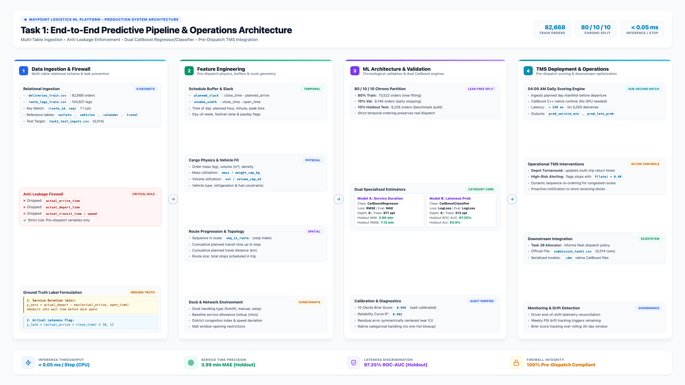

# Datathon Task 1: Architecture & Pipeline Document

## 1. System Architecture Overview

This document presents the complete architectural design of the machine learning system for Waypoint Logistics Task 1, covering data ingestion, feature transformation, model training, and operational deployment.

---

## 2. Model Architecture & Loss Formulations

### A. Service Handling Duration Model (`CatBoostRegressor`)
* **Objective:** Predict outlet handling/unloading duration ($\hat{y} \ge 0$).
* **Loss Function:** Root Mean Squared Error (RMSE) to penalize large delivery deviations:
  $$\mathcal{L}_{\text{RMSE}} = \sqrt{\frac{1}{N} \sum_{i=1}^N (y_i - \hat{y}_i)^2}$$
* **Evaluation Metric:** Mean Absolute Error (MAE) for operational interpretability:
  $$\text{MAE} = \frac{1}{N} \sum_{i=1}^N |y_i - \hat{y}_i|$$
* **Tree Hyperparameters:**
  - `depth`: 8 (captures complex interactions between dock type, cargo mass, and vehicle access)
  - `learning_rate`: 0.05
  - `iterations`: 1,500 with early-stopping patience of 50 rounds (optimal stopping at 971 iterations)
  - `loss_function`: "RMSE", `eval_metric`: "MAE"

---

### B. Arrival Lateness Probability Model (`CatBoostClassifier`)
* **Objective:** Estimate well-calibrated posterior probability of delivery window failure:
  $$p = P(\text{actual\_arrive\_time} > \text{window\_close\_time} \mid \mathbf{x})$$
* **Loss Function:** Binary Cross-Entropy (LogLoss) for optimal probabilistic calibration:
  $$\mathcal{L}_{\text{LogLoss}} = - \frac{1}{N} \sum_{i=1}^N \left[ y_i \log(\hat{p}_i) + (1 - y_i) \log(1 - \hat{p}_i) \right]$$
* **Tree Hyperparameters:**
  - `depth`: 8
  - `learning_rate`: 0.05
  - `iterations`: 1,500 with early-stopping patience of 50 rounds (optimal stopping at 513 iterations)
  - `loss_function`: "Logloss", `eval_metric`: "Logloss"

---

## 3. Proposed Production Deployment Approach

To operationalize these models within Waypoint Logistics' Transport Management System (TMS):

1. **Pre-Dispatch Batch Scoring Engine:**
   - At 04:00 AM daily (before vehicle departures), the TMS passes the day's planned dispatch manifest through the feature engineering pipeline.
   - Inference latency: CatBoost C++ native runtime scores the entire daily manifest ($>5,000$ deliveries) in **under 250 milliseconds** on standard CPU hardware without GPU requirements.
2. **Operational Dispatch Dashboard:**
   - **Service Time Expectations:** The predicted handling minutes ($\text{pred\_service\_min}$) dynamically update estimated return times at the depot for multi-trip vehicle turns.
   - **High-Risk Lateness Alerting:** Deliveries with $\text{pred\_late\_prob} > 0.40$ are automatically flagged for dispatcher intervention (e.g. sequence re-ordering, assigning dedicated couriers, or notifying outlet managers).
3. **Continuous Monitoring & Drift Detection:**
   - When drivers log actual departure times at the end of each shift, actual metrics are compared against predictions.
   - Population Stability Index (PSI) and Brier calibration score are monitored weekly to trigger automated retraining when road or seasonal regimes shift.
